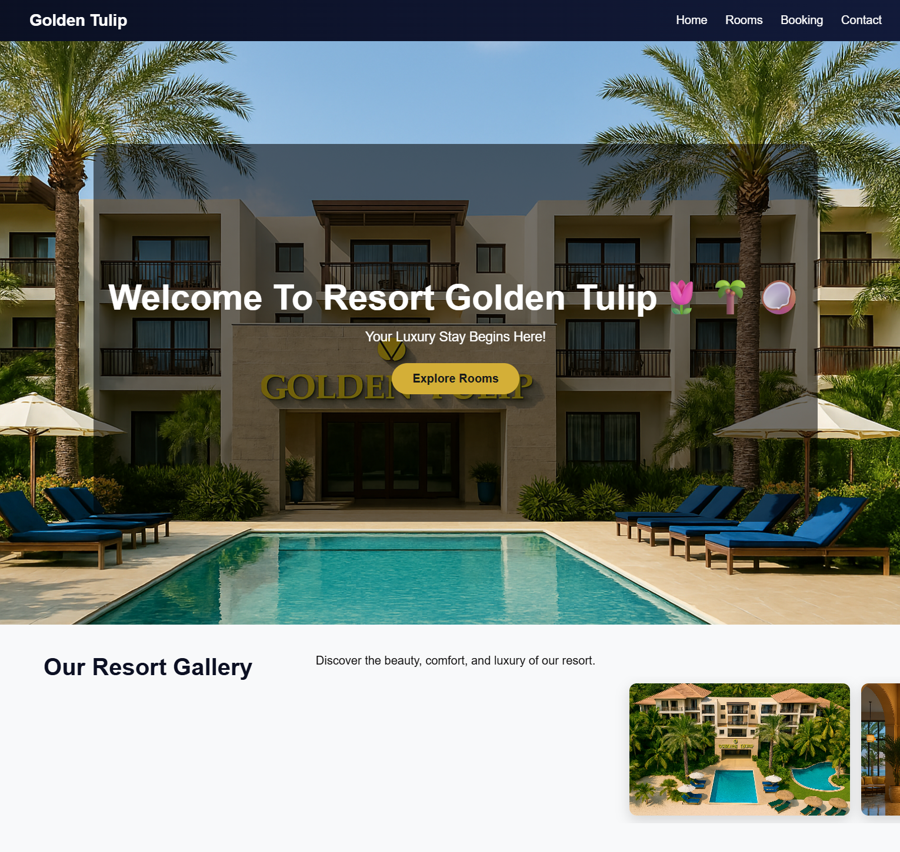
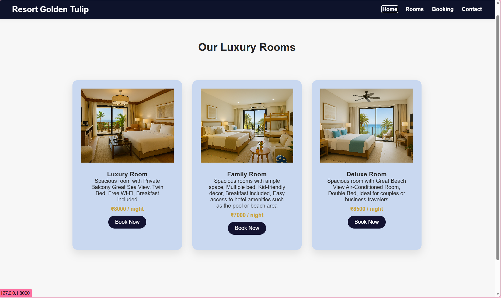
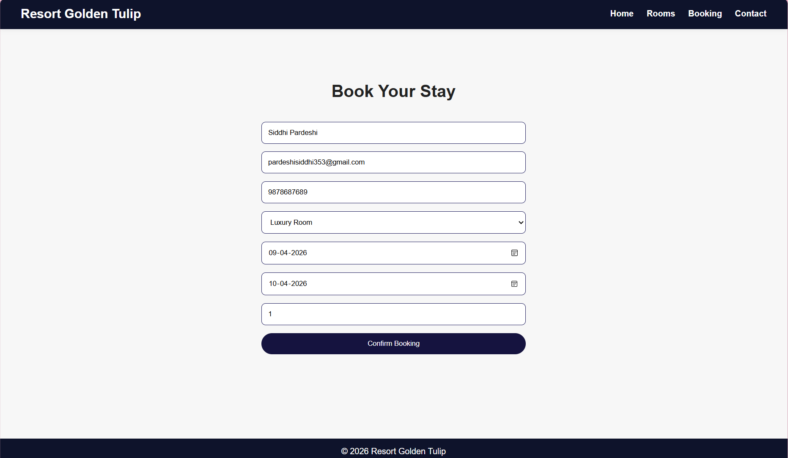
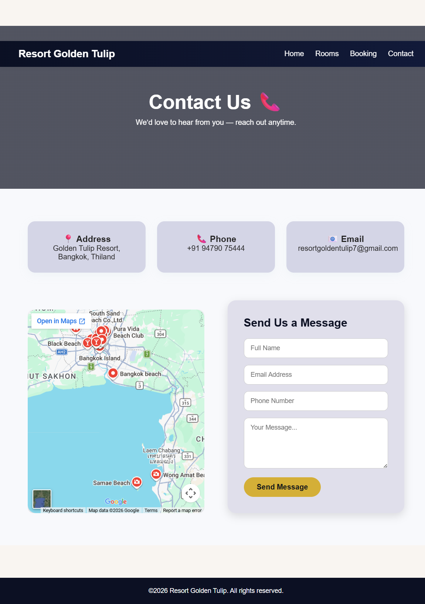
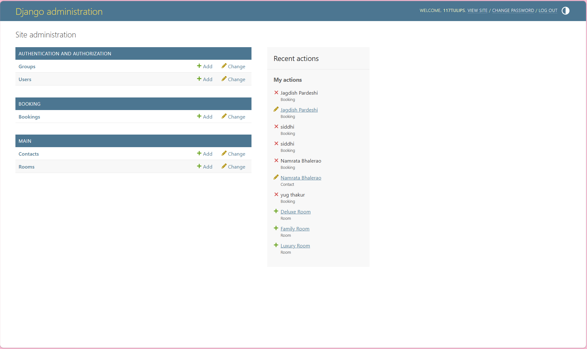
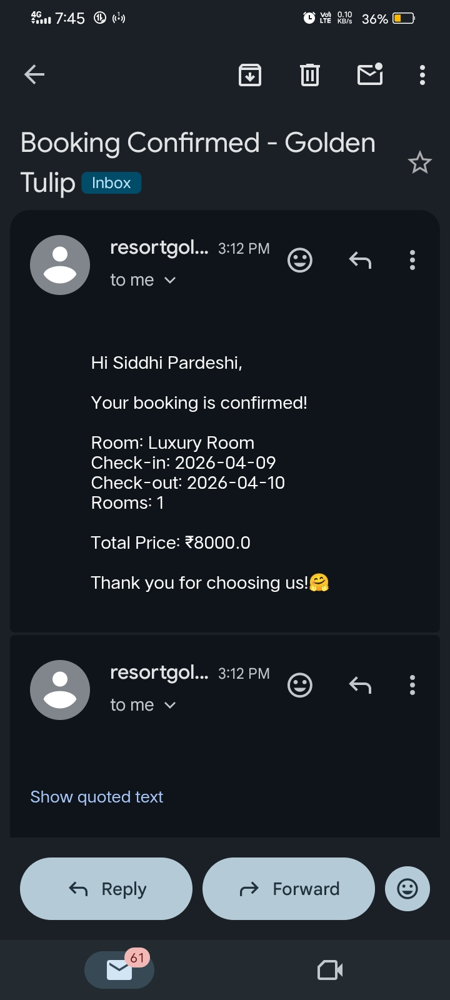

# Hotel Booking Management System

## Project Overview

Hotel Booking Management System is a full-stack web application developed using Django that enables users to browse available rooms, view room details, and make online reservations. The application includes an administrative dashboard for managing rooms, bookings, pricing, customer details, and room availability.

## Technologies Used

* Python
* Django
* SQLite
* HTML
* CSS
* Bootstrap
* JavaScript

## Features

* Room browsing and room details page
* Online room reservation system
* Dynamic booking form
* Booking confirmation page
* Room availability management
* Customer information management
* Django Admin Dashboard
* Contact and inquiry page
* Responsive user interface

## Project Structure

backend/
├── booking/
├── config/
├── main/
├── static/
├── media/
├── db.sqlite3
└── manage.py

## Installation

1. Clone the repository
2. Create a virtual environment
3. Install Django
4. Run migrations
5. Start the development server

```bash
python manage.py runserver
```

## Author

Siddhi Pardeshi
## Screenshots

### Home Page


### Rooms Page


### Booking Form


### Booking Confirmation


### Contact Page


### Admin Dashboard



### Confirmation Mail

